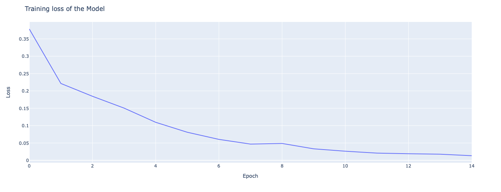

# Improve casual gene prioritization by patient’s phenotype. Identification and parsing of relevant Mendelian disease articles.

## Goal of the project
This project was aimed to create a classifier of articles from the PubMed database to identify articles on Mendelian diseases.

## Methods

To create the classifier, we selected genes for which there is an association with a genetic disease and parsed the OMIM and PubMed databases to obtain articles on these genes. Based on this data, we trained the RoBERTa neural network. Random articles from PubMed were used as a negative class for the classifier.

## Requirements

Python >= 3.6

Packages: all requirement packages are in `requirement.txt`. Install them with `pip install -r requirement.txt`

## Instructions

To execute the code, you need to start Jupiter Notebook Server with the command `jupyter notebook `. Next, select the required file in the Notebook Dashboard.

The code is presented in two files:

* `DataCollection.ipynb` –  collection and parsing of data from the OMIM and PubMed databases.
* `ArticlesClassifier.ipynb` - training and testing the RoBERTa neural network based on the collected data.

## Output

The output of `DataCollection.ipynb` is datasets, which contains train and test data of PubMed articles (title, abstract and label if article is about Mendelian disease). You can find them in the `Data/` folder.

The output of `ArticlesClassifier.ipynb` is `model.pkl` file, which contains parameters of trained model (we do not upload this file to github due to its large size and due to the fact that we are still in the process of increasing the accuracy of the model).
Also it produce the output about model accuracy and graph of loss through the training:

## References

1. Online Mendelian Inheritance in Man, OMIM®. McKusick-Nathans Institute of Genetic Medicine, Johns Hopkins University (Baltimore, MD), {date}. World Wide Web URL: https://omim.org/
2. Pubmed. PubMed. Accessed 20 december 2020, https://pubmed.ncbi.nlm.nih.gov/
3. Liu, Y., Ott, M., Goyal, N., Du, J., Joshi, M., Chen, D., Levy, O., Lewis, M., Zettlemoyer, L., & Stoyanov, V. (2019). Roberta: A robustly optimized bert pretraining approach. arXiv:1907.11692 [cs]. http://arxiv.org/abs/1907.11692 